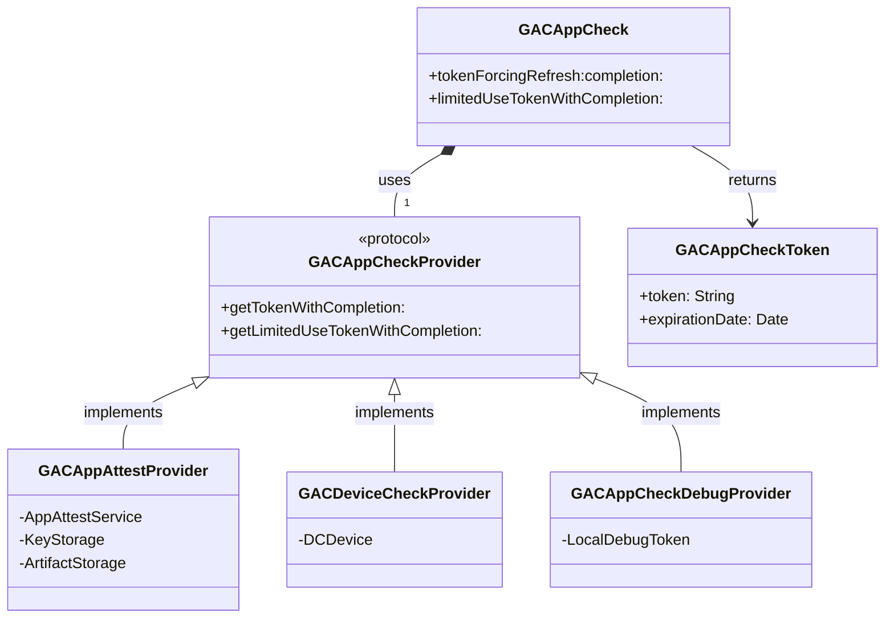

# App Check Core - Documentation

## Introduction
`AppCheckCore` is the underlying engine for app attestation and token
management, primarily used by the Firebase iOS SDK but designed for
broader internal Google use. It provides a robust and secure way to
verify the authenticity of app instances accessing your backend
resources. This library supports applications running on iOS, macOS,
tvOS, and watchOS.

## Key Features
*   **Token Management:** Handles the lifecycle of App Check tokens,
    including caching and automatic refreshing to ensure continuous
    protection.
*   **Provider Abstraction:** Abstracts different attestation providers,
    allowing for flexible integration with various platform-specific
    integrity mechanisms.
*   **Limited-Use Tokens:** Supports the generation and management of
    limited-use tokens for scenarios requiring single-use or short-lived
    authentication.

## Documentation Sections
*   [Getting Started](getting-started.md): Installation and basic setup.
*   [Usage Guide](usage.md): How to initialize and fetch tokens.
*   [Providers Deep Dive](providers.md): Detailed architectural
    breakdown of App Attest, DeviceCheck, and Debug providers,
    including sequence diagrams.
*   [Architecture](architecture.md): Internal design details regarding
    token storage, caching strategies, and threading.
*   [API Reference](api-reference.md): High-level class overview.

## High-Level Architecture
This diagram illustrates the core relationships. For detailed sequence
flows, see [Providers Deep Dive](providers.md).

