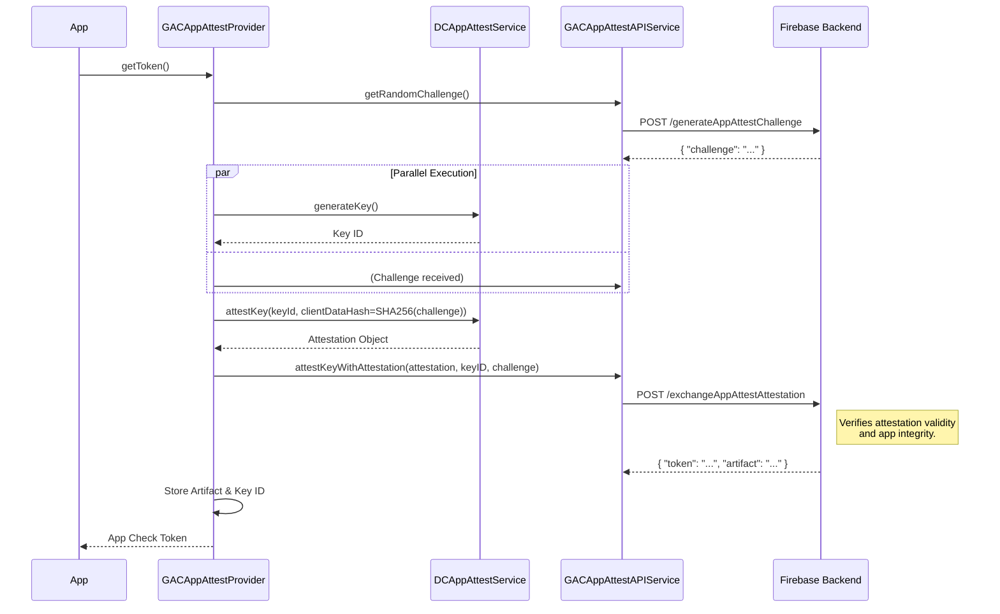
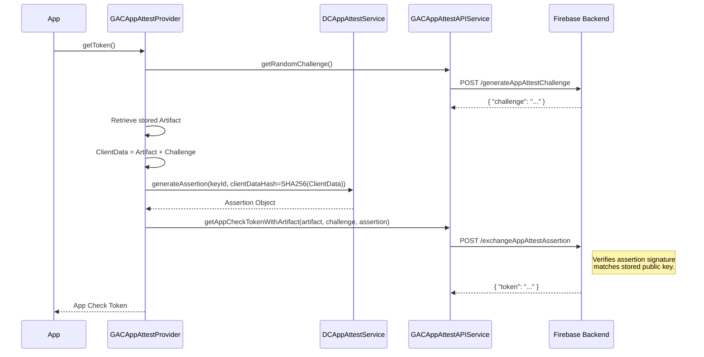
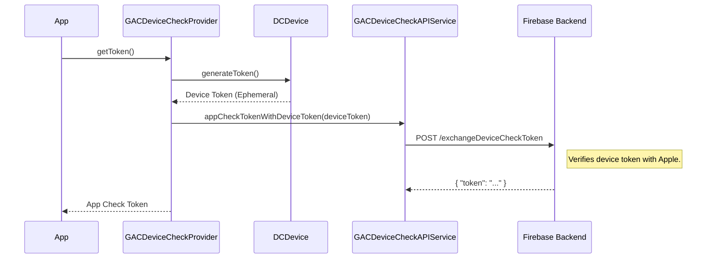
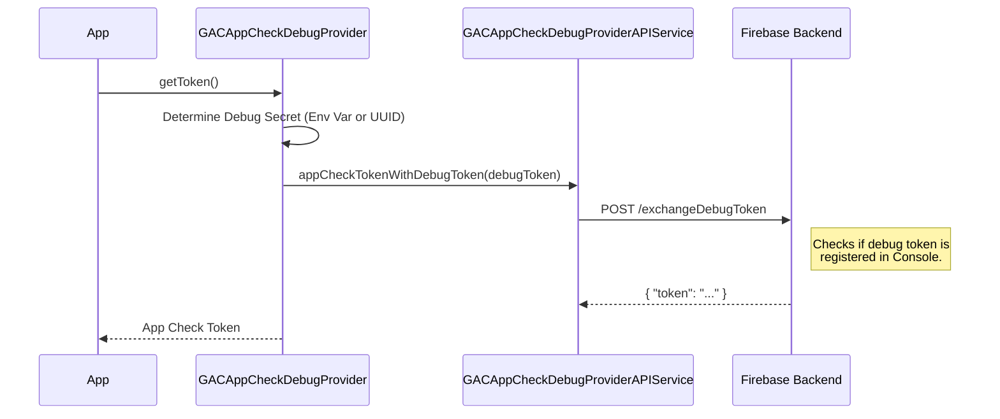

# App Check Providers: Deep Dive

This document details the internal design and detailed flows of each App Check provider.

## AppAttest Provider (`GACAppAttestProvider`)
The most complex provider, interacting with `DCAppAttestService`. It maintains a stable key pair on the device to sign assertions.

### Components
*   **Service:** `DCAppAttestService` (Apple's API).
*   **Storage:**
    *   `GACAppAttestKeyIDStorage`: Stores the generated App Attest Key ID.
    *   `GACAppAttestArtifactStorage`: Stores the "artifact" returned by the Firebase backend after a successful initial handshake. This artifact effectively links the on-device key to the backend session.

### Flow 1: Initial Handshake (Attestation)
Occurs when the app runs for the first time or if the stored artifact is missing/corrupted.

### Flow 2: Token Refresh (Assertion)
Occurs for subsequent requests. It's faster and uses the established key pair.

---

## DeviceCheck Provider (`GACDeviceCheckProvider`)
A simpler provider for older devices.

### Components
*   **Service:** `DCDevice` (Apple's API).
*   **Generator:** `DCDevice.currentDevice` (can be mocked for testing).

### Flow

---

## Debug Provider (`GACAppCheckDebugProvider`)
Used for local development and CI.

### Configuration
The provider looks for a debug secret in the following order:
1.  **Environment Variable:** `AppCheckDebugToken` (or legacy `FIRAAppCheckDebugToken`).
2.  **Local Storage:** `NSUserDefaults` key `GACAppCheckDebugToken`.
3.  **Generation:** If neither exists, it generates a new UUID, stores it in `NSUserDefaults`, and logs it to the console (warning level).

### Flow
