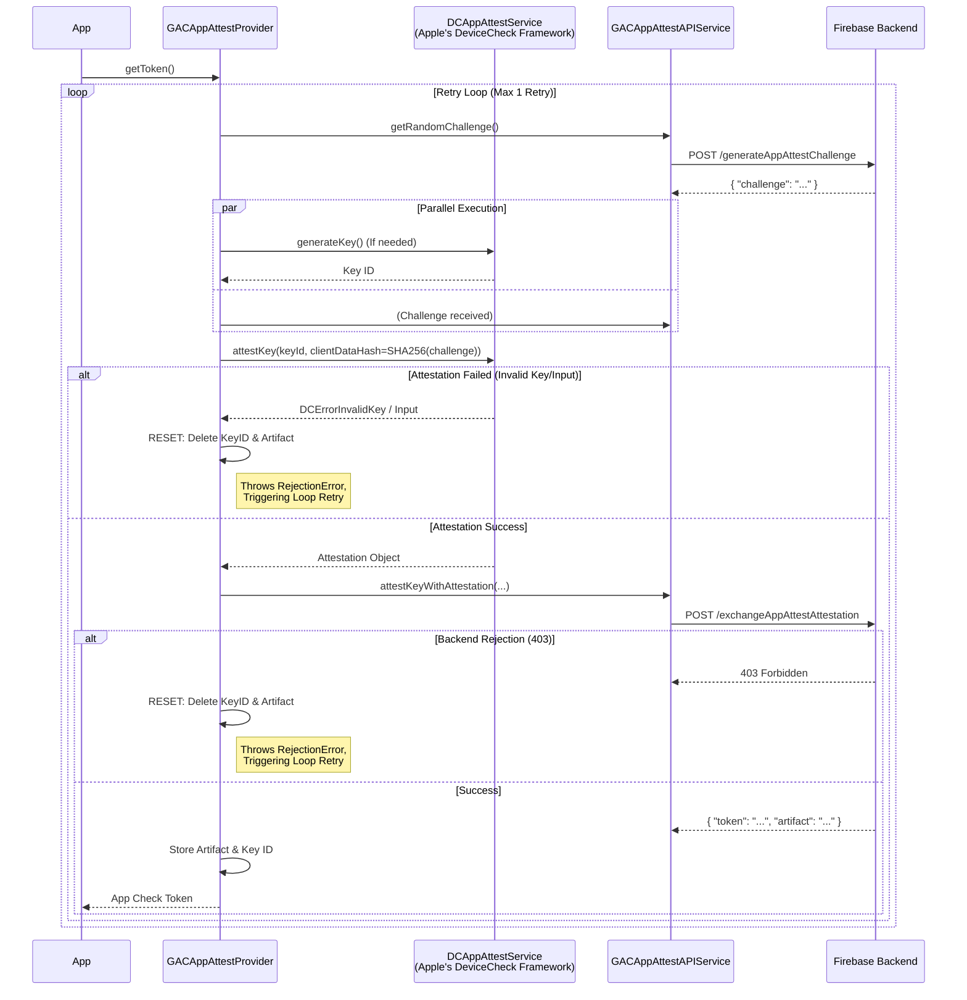
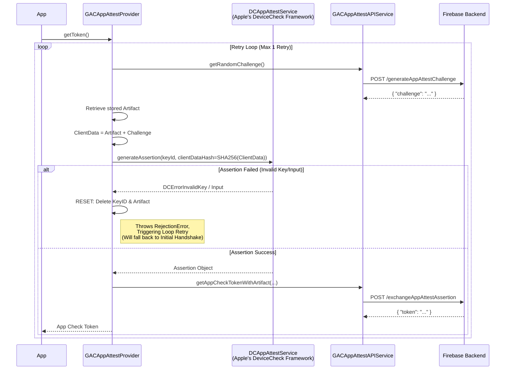
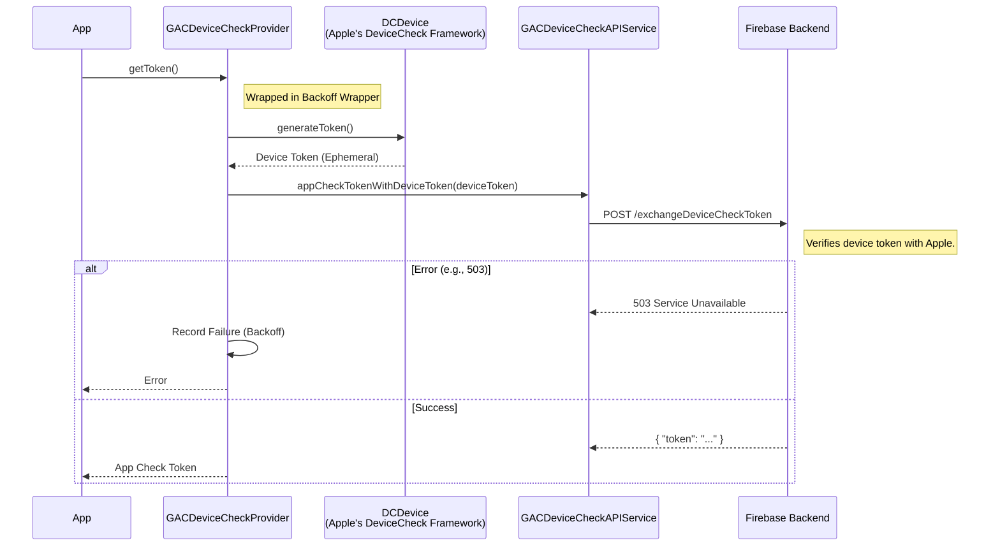
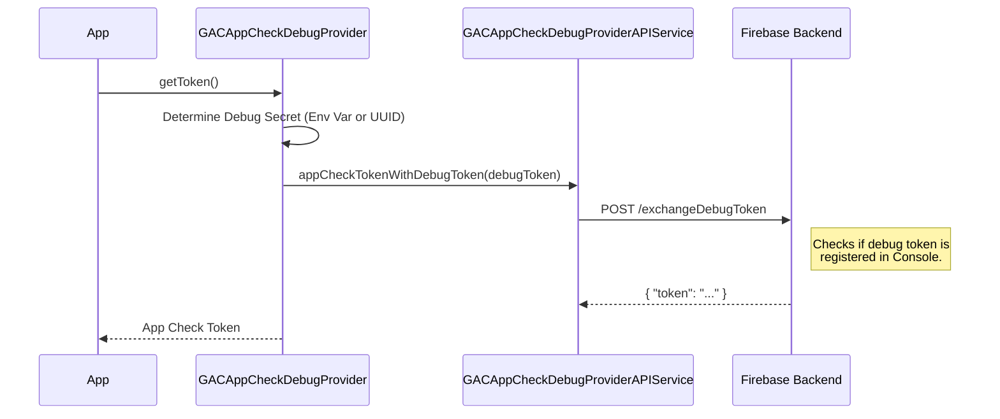

# App Check Providers: Deep Dive

This document details the internal design and detailed flows of each
App Check provider, including error handling, retries, and state
resets.

## AppAttest Provider (`GACAppAttestProvider`)
The most complex provider, interacting with `DCAppAttestService`. It
maintains a stable key pair on the device to sign assertions.

### Components
*   **Service:** `DCAppAttestService` (Apple's API).
*   **Storage:**
    *   `GACAppAttestKeyIDStorage`: Stores the generated App Attest Key
        ID.
    *   `GACAppAttestArtifactStorage`: Stores the "artifact" returned by
        the Firebase backend after a successful initial handshake. This
        artifact effectively links the on-device key to the backend
        session.
*   **Resiliency:**
    *   **Automatic Retry:** The provider wraps the entire flow in a
        retry loop. If a specific "Rejection Error" occurs (e.g.,
        invalid key), it resets its internal state and retries the flow
        from scratch.

### Flow 1: Initial Handshake (Attestation)
Occurs when the app runs for the first time, or if the stored artifact
is missing, or **after a reset**.

### Flow 2: Token Refresh (Assertion)
Occurs for subsequent requests using the established key pair.

---

## DeviceCheck Provider (`GACDeviceCheckProvider`)
A simpler provider for older devices.

### Components
*   **Service:** `DCDevice` (Apple's API).
*   **Generator:** `DCDevice.currentDevice`.

### Flow

---

## Debug Provider (`GACAppCheckDebugProvider`)
Used for local development and CI.

### Configuration
The provider looks for a debug secret in the following order:
1.  **Environment Variable:** `AppCheckDebugToken` (or legacy
    `FIRAAppCheckDebugToken`).
2.  **Local Storage:** `NSUserDefaults` key `GACAppCheckDebugToken`.
3.  **Generation:** If neither exists, it generates a new UUID, stores it
    in `NSUserDefaults`, and logs it to the console (warning level).

### Flow
