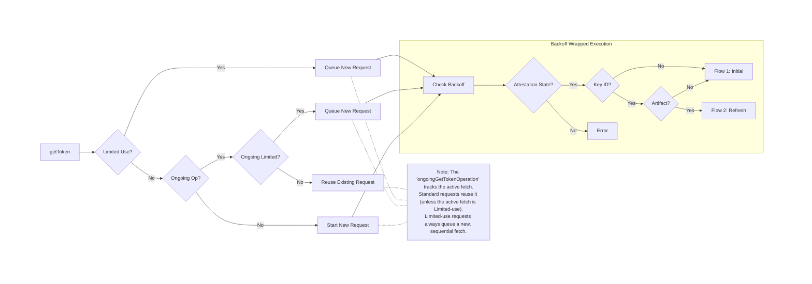
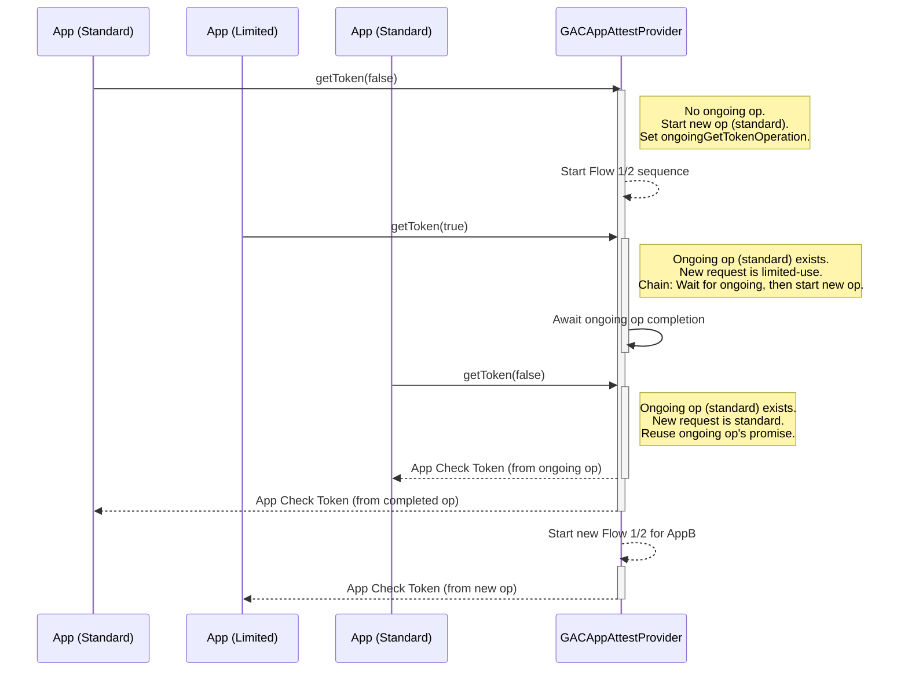
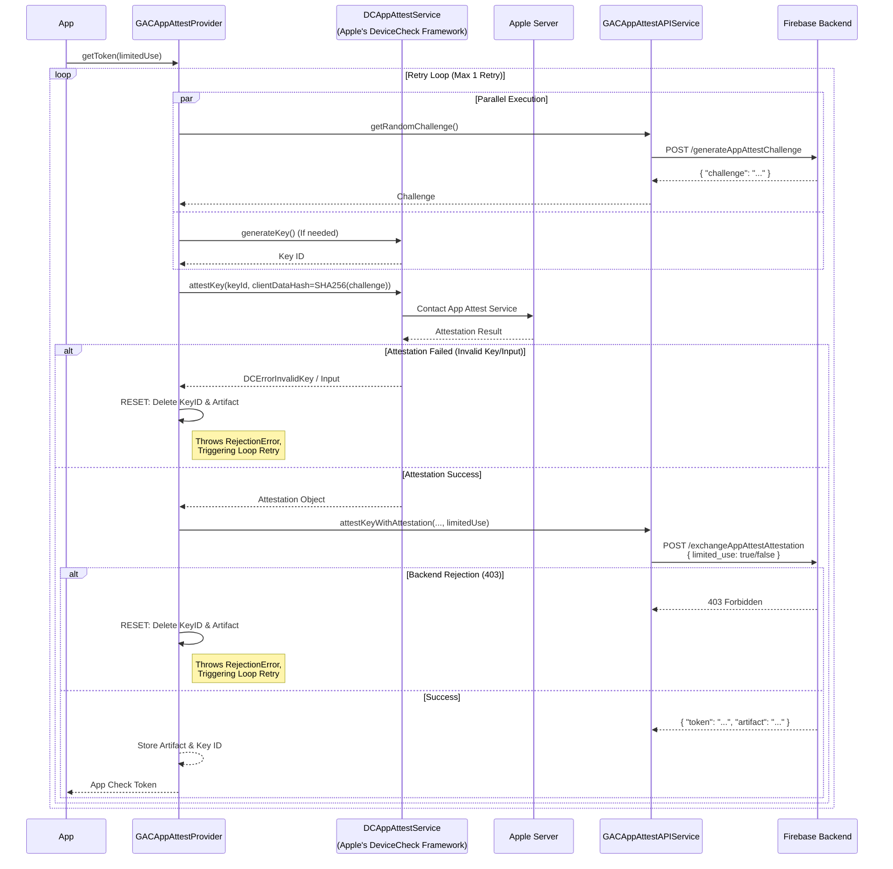
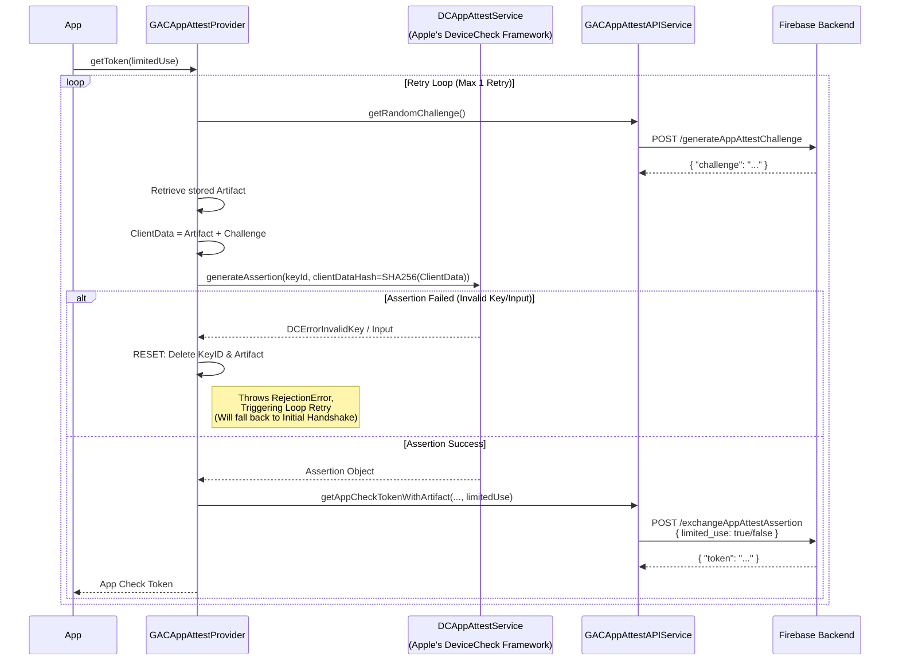

# AppAttest Provider (`GACAppAttestProvider`)

The most complex provider, interacting with `DCAppAttestService`. It
maintains a stable key pair on the device to sign assertions.

## Components
*   **Service:** `DCAppAttestService` (Apple's API).
*   **Storage:**
    *   `GACAppAttestKeyIDStorage`: Stores the generated App Attest Key
        ID.
        *   **Location:** `UserDefaults` (Suite: `com.firebase.GACAppAttestKeyIDStorage`).
    *   `GACAppAttestArtifactStorage`: Stores the "artifact" returned by
        the Firebase backend after a successful initial handshake. This
        artifact effectively links the on-device key to the backend
        session.
        *   **Location:** Keychain (Service: `com.firebase.app_check.app_attest_artifact_storage`).
*   **Resiliency:**
    *   **Automatic Retry (Internal):** The provider includes an internal
        retry loop (max 1 attempt) with a 0-second delay. This loop is
        specifically triggered if an error wrapped as
        `GACAppAttestRejectionError` occurs.
        *   **Triggers for Reset & Internal Retry:**
            *   `DCErrorInvalidKey` / `DCErrorInvalidInput` (Apple DeviceCheck error).
            *   HTTP 403 (Attestation Rejected) from the backend during handshake.
        *   **Transient Error Handling (No Reset):** If `DCErrorServerUnavailable`
            (indicating a temporary issue reaching Apple's App Attest service) occurs,
            the request fails, but the App Attest key and artifact are **preserved**.
            This allows the app to retry the request later using the same key,
            aligning with Apple's recommendation to preserve the device's risk metric.
    *   **Backoff Strategy (External):** An outer `GACAppCheckBackoffWrapper`
        protects the backend from traffic spikes by enforcing delays on subsequent
        attempts based on the error type.
        *   **No Backoff (Immediately Permitted):** For non-HTTP errors (e.g.,
            Apple's `DCError` like `serverUnavailable`), network connectivity issues,
            storage failures, or parsing errors, the backoff wrapper **does not** enforce
            a delay. Subsequent `getToken` calls by the app are immediately permitted.
        *   **Exponential Backoff:** Applied to retryable server errors.
            *   HTTP 403 (Project/App Deleted) *if internal retry fails*.
            *   HTTP 429 (Too Many Requests).
            *   HTTP 503 (Server Overloaded).
            *   Other HTTP 5xx (Server Errors) or 4xx not listed above or handled by 1 day backoff.
        *   **1 Day Backoff:** Applied to configuration errors unlikely to resolve quickly.
            *   HTTP 400 (Bad Request).
            *   HTTP 404 (Not Found).

## Decision Logic & State Machine
Before executing a handshake, the provider determines the correct flow
based on the internal state and manages concurrent requests.

**Note on Limited Use:** Limited-use tokens are never reused/coalesced.
If a limited-use token is requested (or if one is currently being
fetched), the new request will "chain" (wait for the ongoing one to
finish) and then start a fresh handshake to ensure a unique token is
generated.

## Concurrent Request Handling
The `GACAppAttestProvider` carefully manages concurrent calls to
`getToken(limitedUse:)` to ensure correctness and efficiency:

*   **No Ongoing Operation:** If no token fetching operation is in
    progress, a new one is started, and its promise is stored as the
    `ongoingGetTokenOperation`.
*   **Reuse (Standard Tokens Only):** If a standard (non-limited use)
    token is requested, and there's an `ongoingGetTokenOperation` that
    is also for a standard token, the existing promise is reused. This
    ensures only one actual token fetch occurs for multiple concurrent
    standard requests.
*   **Chaining (Limited-Use or Mismatched Requests):**
    *   If a limited-use token is requested, *or*
    *   If a standard token is requested but the `ongoingGetTokenOperation`
        is for a limited-use token (or vice versa),
    the new request will **chain**. This means it waits for the currently
    `ongoingGetTokenOperation` to complete, and then initiates a *new*, separate
    token fetching sequence. This prevents limited-use tokens from being
    accidentally reused and ensures distinct token types are handled
    independently.

## Flow 1: Initial Handshake (Attestation)
Occurs when the app runs for the first time, or if the stored artifact
is missing, or **after a reset**.

## Flow 2: Token Refresh (Assertion)
Occurs for subsequent requests using the established key pair.

