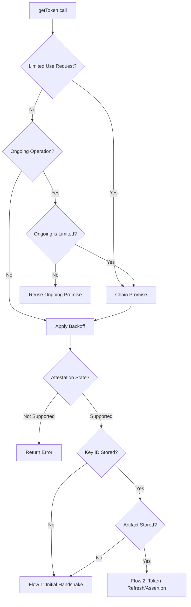
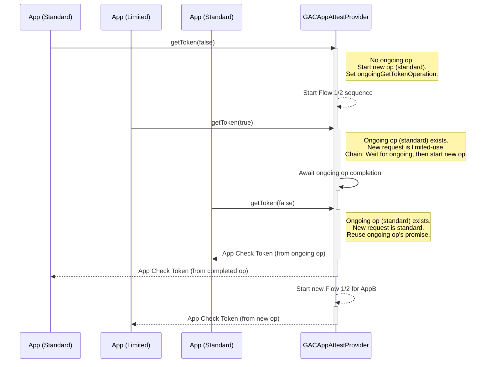
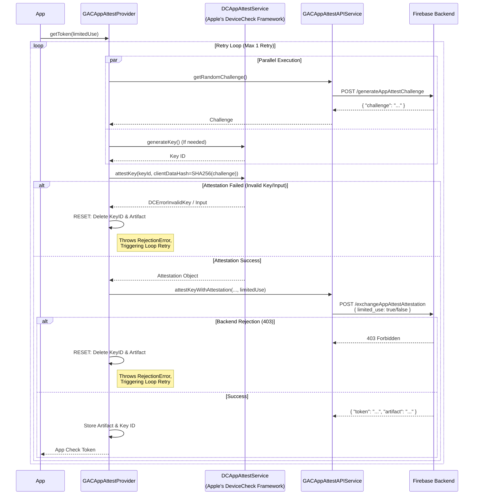
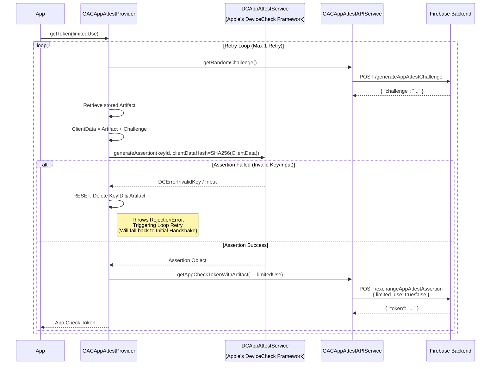

# AppAttest Provider (`GACAppAttestProvider`)

The most complex provider, interacting with `DCAppAttestService`. It
maintains a stable key pair on the device to sign assertions.

## Components
*   **Service:** `DCAppAttestService` (Apple's API).
*   **Storage:**
    *   `GACAppAttestKeyIDStorage`: Stores the generated App Attest Key
        ID.
    *   `GACAppAttestArtifactStorage`: Stores the "artifact" returned by
        the Firebase backend after a successful initial handshake. This
        artifact effectively links the on-device key to the backend
        session.
*   **Resiliency:**
    *   **Automatic Retry:** The provider wraps the entire flow in a
        retry loop. If a specific "Rejection Error" occurs (e.g.,
        invalid key), it resets its internal state and retries the flow
        from scratch.

## Decision Logic & State Machine
Before executing a handshake, the provider determines the correct flow
based on the internal state and manages concurrent requests.

**Note on Limited Use:** Limited-use tokens are never reused/coalesced.
If a limited-use token is requested (or if one is currently being
fetched), the new request will "chain" (wait for the ongoing one to
finish) and then start a fresh handshake to ensure a unique token is
generated.

## Concurrent Request Handling
The `GACAppAttestProvider` carefully manages concurrent calls to
`getToken(limitedUse:)` to ensure correctness and efficiency:

*   **No Ongoing Operation:** If no token fetching operation is in
    progress, a new one is started, and its promise is stored as the
    `ongoingGetTokenOperation`.
*   **Reuse (Standard Tokens Only):** If a standard (non-limited use)
    token is requested, and there's an `ongoingGetTokenOperation` that
    is also for a standard token, the existing promise is reused. This
    ensures only one actual token fetch occurs for multiple concurrent
    standard requests.
*   **Chaining (Limited-Use or Mismatched Requests):**
    *   If a limited-use token is requested, *or*
    *   If a standard token is requested but the `ongoingGetTokenOperation`
        is for a limited-use token (or vice versa),
    the new request will **chain**. This means it waits for the currently
    `ongoingGetTokenOperation` to complete, and then initiates a *new*, separate
    token fetching sequence. This prevents limited-use tokens from being
    accidentally reused and ensures distinct token types are handled
    independently.

## Flow 1: Initial Handshake (Attestation)
Occurs when the app runs for the first time, or if the stored artifact
is missing, or **after a reset**.

## Flow 2: Token Refresh (Assertion)
Occurs for subsequent requests using the established key pair.

