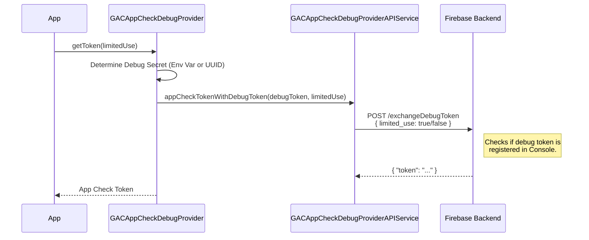

# Debug Provider (`GACAppCheckDebugProvider`)

Used for local development and CI.

## Configuration
The provider looks for a debug secret in the following order:
1.  **Environment Variable:** `AppCheckDebugToken` (or legacy
    `FIRAAppCheckDebugToken`).
2.  **Local Storage:** `NSUserDefaults` key `GACAppCheckDebugToken`.
3.  **Generation:** If neither exists, it generates a new UUID, stores it
    in `NSUserDefaults`, and logs it to the console (warning level).

## Flow

