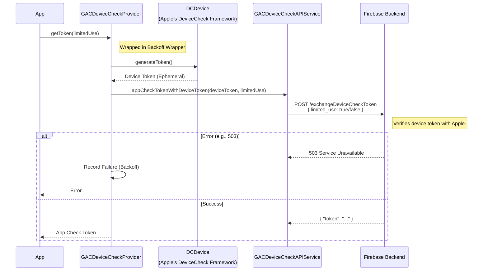

# DeviceCheck Provider (`GACDeviceCheckProvider`)

A simpler provider for older devices.

## Components
*   **Service:** `DCDevice` (Apple's API).
*   **Generator:** `DCDevice.currentDevice`.

## Flow

