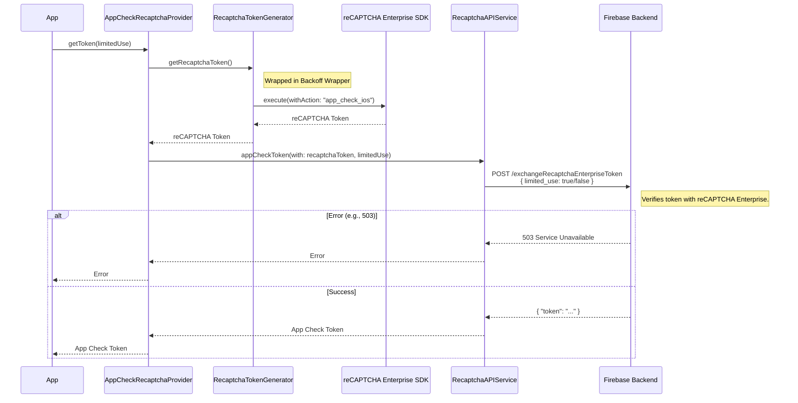

# reCAPTCHA Provider (`AppCheckRecaptchaProvider` / `GACRecaptchaProvider`)

A provider that verifies app integrity using the reCAPTCHA Enterprise API.

## Components
*   **Token Generator:** `RecaptchaTokenGenerator` (Wraps the `RCARecaptchaClientProtocol` to fetch reCAPTCHA tokens).
*   **Service:** `RecaptchaAPIService` (Exchanges the reCAPTCHA token for an App Check token).

## Flow

