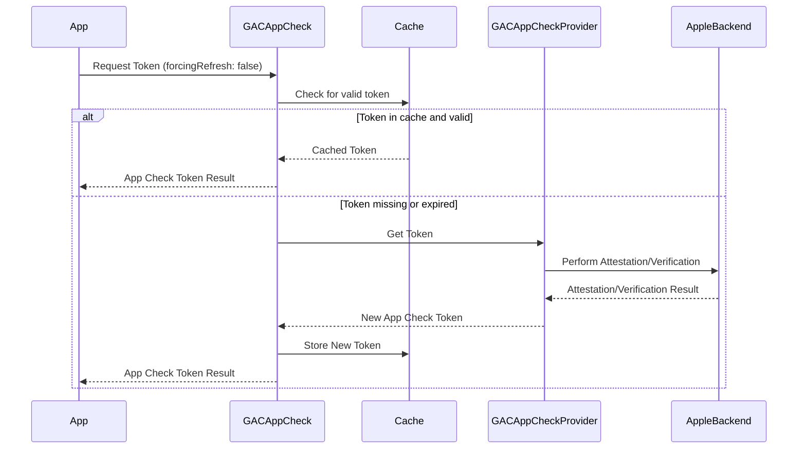

# Core Integration and Usage

## Initialization

To use `AppCheckCore`, you first need to initialize an `AppCheckCoreProvider` implementation (e.g., `AppCheckCoreAppAttestProvider`) and then use it to initialize `AppCheckCore`.

### Swift
```swift
import AppCheckCore
import Foundation

// 1. Initialize an App Check Provider
//    Replace "my-sdk" with your SDK's unique identifier.
//    Replace "projects/123/apps/abc" with your actual resource name.
//    Set baseURL and APIKey if needed, otherwise nil.
//    Provide a keychainAccessGroup if you use one.
let provider = AppCheckCoreAppAttestProvider(serviceName: "my-sdk",
                                             resourceName: "projects/123/apps/abc",
                                             baseURL: nil,
                                             APIKey: nil,
                                             keychainAccessGroup: nil,
                                             requestHooks: nil)

// 2. Initialize AppCheckCore
//    You can optionally provide settings and a token delegate.
let appCheck = AppCheckCore(serviceName: "my-sdk",
                            resourceName: "projects/123/apps/abc",
                            appCheckProvider: provider,
                            settings: AppCheckCoreSettings(), // Use default settings or provide your own
                            tokenDelegate: nil, // Provide a delegate to observe token changes
                            keychainAccessGroup: nil)
```

### Objective-C
```objectivec
#import <AppCheckCore/AppCheckCore.h>
#import <AppCheckCore/GACAppAttestProvider.h>

// 1. Initialize an App Check Provider
//    Replace "my-sdk" with your SDK's unique identifier.
//    Replace "projects/123/apps/abc" with your actual resource name.
//    Set baseURL and APIKey if needed, otherwise nil.
//    Provide a keychainAccessGroup if you use one.
GACAppAttestProvider *provider =
    [[GACAppAttestProvider alloc] initWithServiceName:@"my-sdk"
                                         resourceName:@"projects/123/apps/abc"
                                              baseURL:nil
                                               APIKey:nil
                                  keychainAccessGroup:nil
                                         requestHooks:nil];

// 2. Initialize AppCheckCore
//    You can optionally provide settings and a token delegate.
GACAppCheck *appCheck =
    [[GACAppCheck alloc] initWithServiceName:@"my-sdk"
                                resourceName:@"projects/123/apps/abc"
                            appCheckProvider:provider
                                    settings:[[GACAppCheckSettings alloc] init] // Use default settings or provide your own
                               tokenDelegate:nil // Provide a delegate to observe token changes
                         keychainAccessGroup:nil];
```

## Fetching Tokens

`AppCheckCore` provides methods to fetch App Check tokens, both for general use and for limited-use scenarios.

### Fetching a Standard App Check Token
Use `token(forcingRefresh:completion:)` to retrieve an App Check token. The `forcingRefresh` parameter determines whether to use a cached token or request a new one. In most cases, `NO` (or `false` in Swift) should be used.

### Swift
```swift
appCheck.token(forcingRefresh: false) { result in
    if let token = result.token {
        print("App Check Token: \(token.token)")
        print("Token Expiration: \(token.expirationDate)")
    } else if let error = result.error {
        print("Error fetching App Check token: \(error.localizedDescription)")
    }
}
```

### Objective-C
```objectivec
[appCheck tokenForcingRefresh:NO
                   completion:^(GACAppCheckTokenResult *result) {
  if (result.token) {
    NSLog(@"App Check Token: %@", result.token.token);
    NSLog(@"Token Expiration: %@", result.token.expirationDate);
  } else if (result.error) {
    NSLog(@"Error fetching App Check token: %@", result.error.localizedDescription);
  }
}];
```

### Fetching a Limited-Use App Check Token
For scenarios where you need a token for a single, immediate request without affecting the primary token's refresh cycle, use `limitedUseToken(completion:)`.

### Swift
```swift
appCheck.limitedUseTokenWithCompletion { result in
    if let token = result.token {
        print("Limited-Use App Check Token: \(token.token)")
    } else if let error = result.error {
        print("Error fetching limited-use App Check token: \(error.localizedDescription)")
    }
}
```

### Objective-C
```objectivec
[appCheck limitedUseTokenWithCompletion:^(GACAppCheckTokenResult *result) {
  if (result.token) {
    NSLog(@"Limited-Use App Check Token: %@", result.token.token);
  } else if (result.error) {
    NSLog(@"Error fetching limited-use App Check token: %@", result.error.localizedDescription);
  }
}];
```

## Token Fetching Sequence Diagram
This diagram illustrates the typical flow when an application requests an App Check token.

